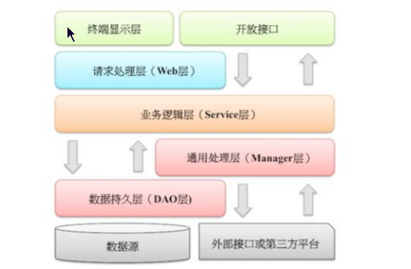

(一)应用分层 

1. 【推荐】图中默认上层依赖于下层，箭头关系表示可直接依赖，如：开放接口层可以依赖于 `Web` 层，也可以直接依赖于 `Service `层，依此类推：

   

   * 开放接口层：可直接封装 `Service` 方法暴露成 `RPC` 接口；通过 `Web` 封装成 `http` 接口；进行 网关安全控制、流量控制等。 
   
   * 终端显示层：各个端的模板渲染并执行显示的层。当前主要是 `velocity` 渲染，`JS` 渲染， `JSP` 渲染，移动端展示等。 
   
   * `Web` 层：主要是对访问控制进行转发，各类基本参数校验，或者不复用的业务简单处理等。 
   
   * `Service` 层：相对具体的业务逻辑服务层。 
   
   * `Manager` 层：通用业务处理层，它有如下特征：
   
     ​	1） 对第三方平台封装的层，预处理返回结果及转化异常信息； 
   
     ​	2） 对 `Service` 层通用能力的下沉，如缓存方案、中间件通用处理； 
   
     ​	3） 与 `DAO` 层交互，对多个 `DAO` 的组合复用。 
   
   * `DAO` 层：数据访问层，与底层 `MySQL`、`Oracle`、`Hbase` 等进行数据交互。 
   
   * 外部接口或第三方平台：包括其它部门 `RPC` 开放接口，基础平台，其它公司的 `HTTP` 接口。
   
2. 【参考】 （分层异常处理规约）在 `DAO` 层，产生的异常类型有很多，无法用细粒度的异常进 行 `catch`，使用 `catch(Exception e)`方式，并 `throw new DAOException(e)`，不需要打印 日志，因为日志在 `Manager/Service `层一定需要捕获并打印到日志文件中去，如果同台服务 器再打日志，浪费性能和存储。在 `Service `层出现异常时，必须记录出错日志到磁盘，尽可能 带上参数信息，相当于保护案发现场。如果 `Manager` 层与 `Service` 同机部署，日志方式与 `DAO` 层处理一致，如果是单独部署，则采用与 `Service `一致的处理方式。Web 层绝不应该继续往上 抛异常，因为已经处于顶层，如果意识到这个异常将导致页面无法正常渲染，那么就应该直接跳转到友好错误页面，加上用户容易理解的错误提示信息。开放接口层要将异常处理成错误码 和错误信息方式返回。

3. 【参考】分层领域模型规约： 

   * `DO（Data Object）`：此对象与数据库表结构一一对应，通过 DAO 层向上传输数据源对象。 

   * `DTO（Data Transfer Object）`：数据传输对象，`Service` 或 `Manager` 向外传输的对象。 

   * `BO（Business Object）`：业务对象，由 `Service` 层输出的封装业务逻辑的对象。 

   * `AO（Application Object）`：应用对象，在 `Web` 层与 `Service` 层之间抽象的复用对象模型， 极为贴近展示层，复用度不高。 

   * `VO（View Object`）：显示层对象，通常是 `Web` 向模板渲染引擎层传输的对象。 

   * `Query`：数据查询对象，各层接收上层的查询请求。注意超过 2 个参数的查询封装，禁止 使用 `Map `类来传输。

(二)二方库依赖

1.  【强制】定义 `GAV` 遵从以下规则：

   * `GroupID` 格式：`com.{公司/BU }.业务线 [.子业务线]`，最多 4 级。

     > 说明：{公司/BU} 例如：`alibaba/taobao/tmall/aliexpress` 等 `BU` 一级；子业务线可选。

   * `ArtifactID` 格式：产品线名-模块名。语义不重复不遗漏，先到中央仓库去查证一下。

     正例：`dubbo-client / fastjson-api / jstorm-tool`

   * `Version`：详细规定参考下方。

2. 【强制】二方库版本号命名方式：主版本号.次版本号.修订号 

   1） 主版本号：产品方向改变，或者大规模 `API `不兼容，或者架构不兼容升级

   2） 次版本号：保持相对兼容性，增加主要功能特性，影响范围极小的 `API` 不兼容修改。 

   3） 修订号：保持完全兼容性，修复 `BUG`、新增次要功能特性等。

   > 说明：注意起始版本号必须为：`1.0.0`，而不是` 0.0.1 `正式发布的类库必须先去中央仓库进 行查证，使版本号有延续性，正式版本号不允许覆盖升级。如当前版本：`1.3.3`，那么下一个 合理的版本号：`1.3.4 `或 `1.4.0` 或 `2.0.0`

3. 【强制】线上应用不要依赖 SNAPSHOT 版本（安全包除外）。 

   > 说明：不依赖 SNAPSHOT 版本是保证应用发布的幂等性。另外，也可以加快编译时的打包构建。

4. 【强制】二方库的新增或升级，保持除功能点之外的其它 `jar `包仲裁结果不变。如果有改变， 必须明确评估和验证，建议进行 `dependency:resolve` 前后信息比对，如果仲裁结果完全不一 致，那么通过 `dependency:tree` 命令，找出差异点，进行排除 `jar` 包。

5. 【强制】二方库里可以定义枚举类型，参数可以使用枚举类型，但是接口返回值不允许使用枚 举类型或者包含枚举类型的 `POJO `对象。

6. 【强制】依赖于一个二方库群时，必须定义一个统一的版本变量，避免版本号不一致。

   > 说明：依赖 `springframework-core,-context,-beans`，它们都是同一个版本，可以定义一 个变量来保存版本：`${spring.version}`，定义依赖的时候，引用该版本。

7. 【强制】禁止在子项目的 `pom `依赖中出现相同的 `GroupId`，相同的 `ArtifactId`，但是不同的 `Version`。 

   > 说明：在本地调试时会使用各子项目指定的版本号，但是合并成一个 war，只能有一个版本号 出现在最后的` lib` 目录中。可能出现线下调试是正确的，发布到线上却出故障的问题。

8. 【推荐】所有 `pom `文件中的依赖声明放在语句块中，所有版本仲裁放在 语句块中。 

   > 说明：里只是声明版本，并不实现引入，因此子项目需要显式的声 明依赖，`version` 和 `scope` 都读取自父 `pom`。而所有声明在主 `pom` 的 里的依赖都会自动引入，并默认被所有的子项目继承。

9. 【推荐】二方库不要有配置项，最低限度不要再增加配置项。

10. 【参考】为避免应用二方库的依赖冲突问题，二方库发布者应当遵循以下原则

    1）**精简可控原则**。移除一切不必要的 `API `和依赖，只包含 `Service API`、必要的领域模型对 象、`Utils` 类、常量、枚举等。如果依赖其它二方库，尽量是 `provided `引入，让二方库使用 者去依赖具体版本号；无 `log` 具体实现，只依赖日志框架。 

    2）**稳定可追溯原则**。每个版本的变化应该被记录，二方库由谁维护，源码在哪里，都需要能 方便查到。除非用户主动升级版本，否则公共二方库的行为不应该发生变化。

(三)服务器 

1. 【推荐】高并发服务器建议调小 `TCP `协议的` time_wait` 超时时间。 

   > 说明：操作系统默认 240 秒后，才会关闭处于` time_wait `状态的连接，在高并发访问下，服 务器端会因为处于 `time_wait` 的连接数太多，可能无法建立新的连接，所以需要在服务器上 调小此等待值。 

   正例：在` linux`服务器上请通过变更`/etc/sysctl.conf`文件去修改该缺省值（秒）： `net.ipv4.tcp_fin_timeout = 30`

2. 【推荐】调大服务器所支持的最大文件句柄数（`File Descriptor`，简写为 `fd`）。 

   > 说明：主流操作系统的设计是将 `TCP/UDP` 连接采用与文件一样的方式去管理，即一个连接对 应于一个` fd`。主流的 linux 服务器默认所支持最大 `fd `数量为 1024，当并发连接数很大时很容易因为` fd `不足而出现“`open too many files`”错误，导致新的连接无法建立。 建议将` linux `服务器所支持的最大句柄数调高数倍（与服务器的内存数量相关）。

3. 【推荐】给 `JVM `环境参数设置`-XX:+HeapDumpOnOutOfMemoryError` 参数，让 `JVM `碰到` OOM `场 景时输出 `dump `信息。 

   > 说明：`OOM `的发生是有概率的，甚至相隔数月才出现一例，出错时的堆内信息对解决问题非常 有帮助。

4. 【推荐】在线上生产环境，`JVM `的 `Xms `和 `Xmx `设置一样大小的内存容量，避免在 `GC `后调整堆 大小带来的压力。

5. 【参考】服务器内部重定向使用 `forward`；外部重定向地址使用` URL` 拼装工具类来生成，否则 会带来 `URL `维护不一致的问题和潜在的安全风险。